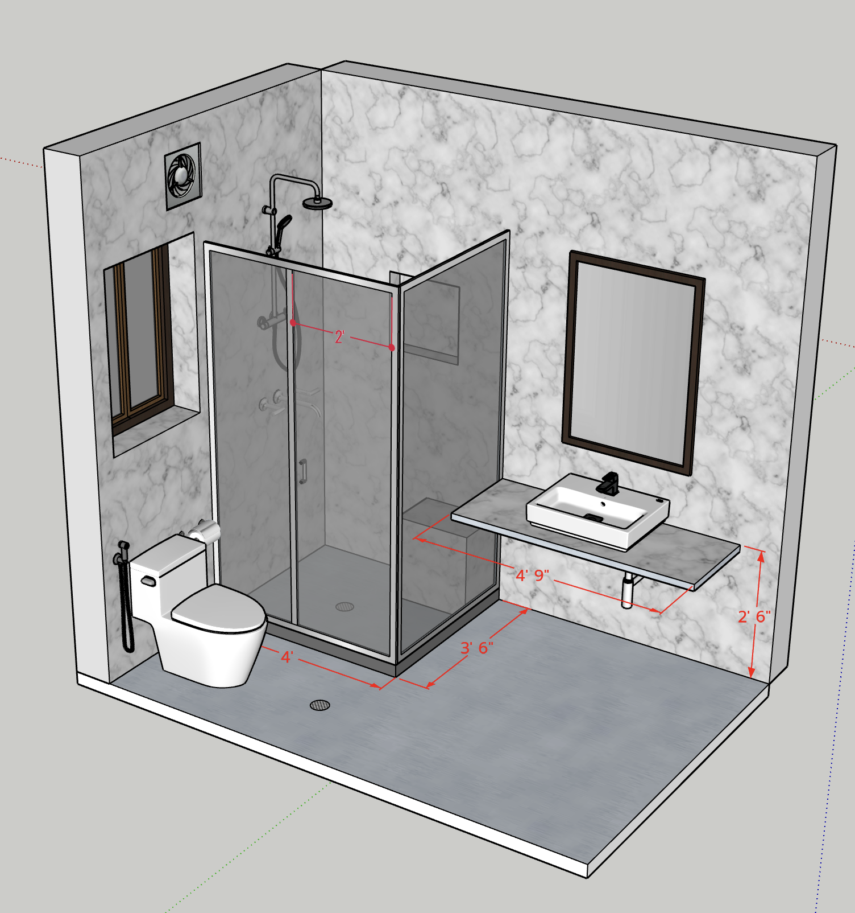

#  Bathrooms 

[Back To Home Page](../)

## Bathrooms

  [Grnd Flr - Common](#grnd-flr---common)
  [Grnd Flr - Attached](#grnd-flr---attached)
  [1st Flr - Common](#1st-flr---common)
  [1st Flr - Attached](#1st-flr---attached)
  

## Grnd Flr - Common

## Grnd Flr - Attached

## 1st Flr - Common

### Side View

### Front View

### Rear View

### Top View

## 1st Flr - Attached

[Back To Home Page](../)