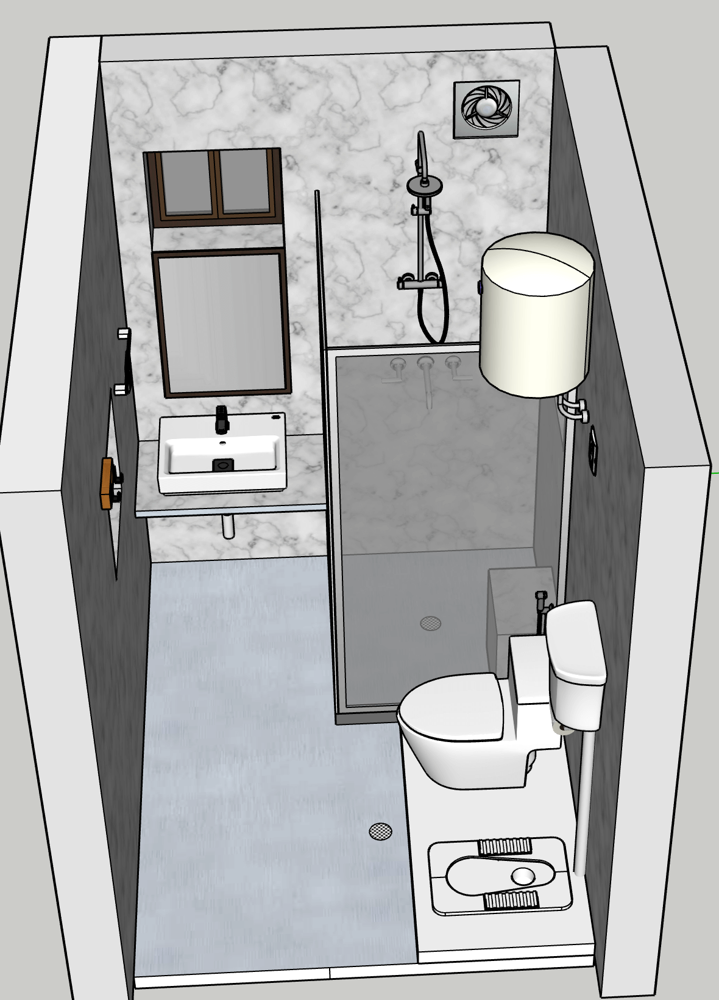
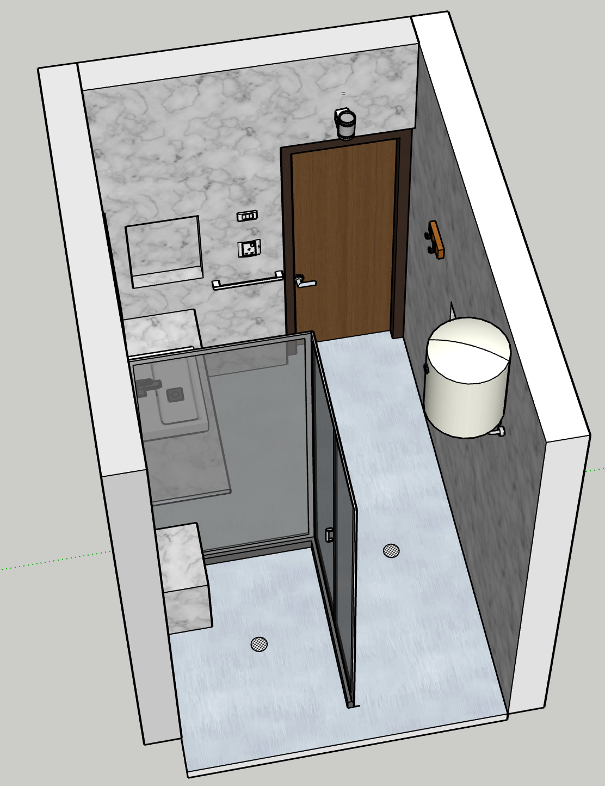

#  Bathrooms 

[Back To Home Page](../)

1. [Grnd Flr - Common](#grnd-flr---common)
2. [Grnd Flr - Attached](#grnd-flr---attached)
3. [1st Flr - Common](#1st-flr---common)
4. [1st Flr - Attached](#1st-flr---attached)
  

## Grnd Flr - Common

### Side View- Grnd-Common

### Side View2- Grnd-Common

### Front View- Grnd-Common

### Rear View- Grnd-Common

### Top View- Grnd-Common

## Grnd Flr - Attached

## 1st Flr - Common

### Side View

### Front View

### Rear View

### Top View

## 1st Flr - Attached

[Back To Home Page](../)