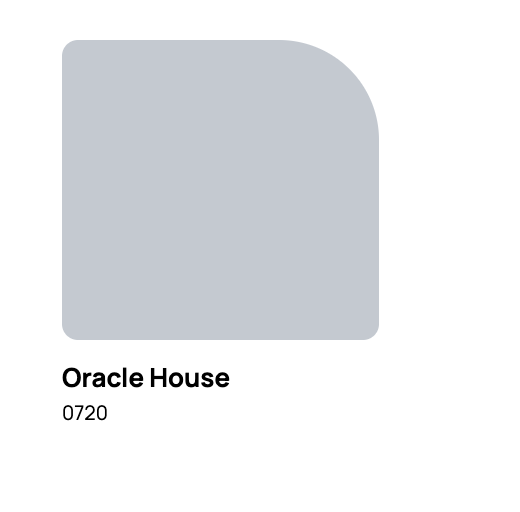
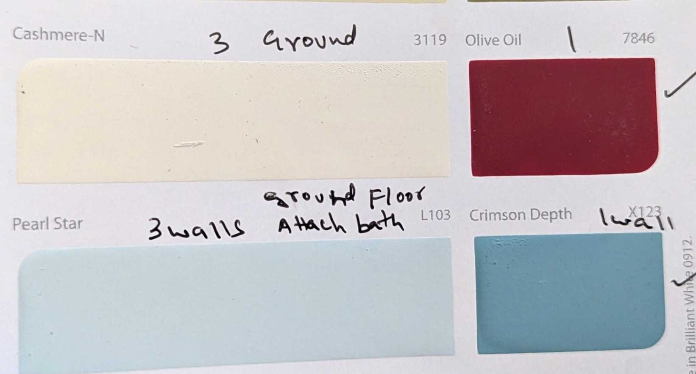
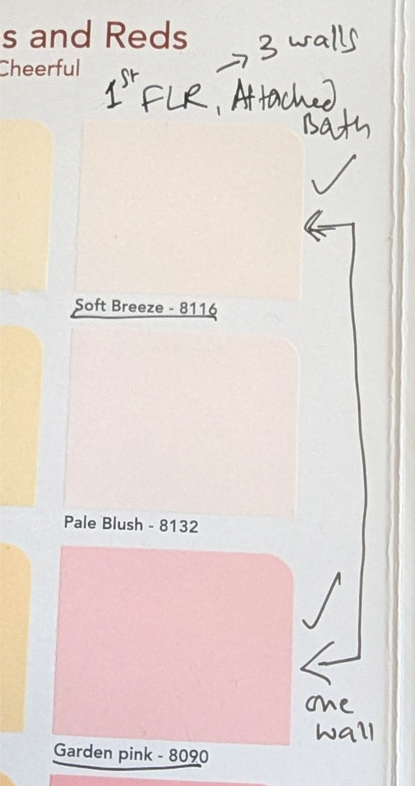
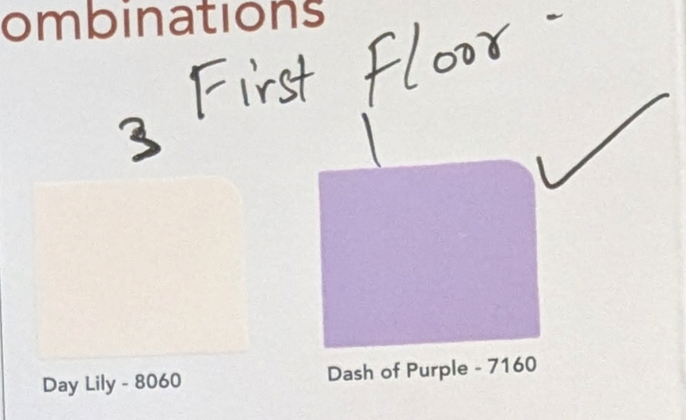

# Wall Colors

[Back To Home Page](./)

_3 Walls = base color, 4th Wall = accent color. Each cell includes which wall(s) the color applies to._

<table style="border-collapse: collapse; width: 100%;">
  <thead>
    <tr>
      <th style="border: 1px solid #333; padding: 8px;">Floor</th>
      <th style="border: 1px solid #333; padding: 8px;">Room Description</th>
      <th style="border: 1px solid #333; padding: 8px;">3 Walls</th>
      <th style="border: 1px solid #333; padding: 8px;">4th Wall</th>
    </tr>
  </thead>
  <tbody>
    <tr>
      <td style="border: 1px solid #333; padding: 8px;">Ground Flr</td>
      <td style="border: 1px solid #333; padding: 8px;">Room1 (with attached bath)</td>
      <td style="border: 1px solid #333; padding: 8px; background-color: #D8ECEF; color: #222;">Pearl Star - L103</td>
      <td style="border: 1px solid #333; padding: 8px; background-color: #4A93A8; color: #fff;">Crimson Depth - X123 <small>Wall oposite bed with no windows</small></td>
    </tr>
    <tr>
      <td style="border: 1px solid #333; padding: 8px;">Ground Flr</td>
      <td style="border: 1px solid #333; padding: 8px;">Room2</td>
      <td style="border: 1px solid #333; padding: 8px; background-color: #F0EAD6; color: #222;">Cashmere-N - 3119</td>
      <td style="border: 1px solid #333; padding: 8px; background-color: #7C1F30; color: #fff;">Olive Oil - 7846 <small>Wall opposite the large window, Right side to entry door</small></td>
    </tr>
    <tr>
      <td style="border: 1px solid #333; padding: 8px;">Ground Flr</td>
      <td style="border: 1px solid #333; padding: 8px;">Guest Room</td>
      <td style="border: 1px solid #333; padding: 8px;"></td>
      <td style="border: 1px solid #333; padding: 8px;"></td>
    </tr>
    <tr>
      <td style="border: 1px solid #333; padding: 8px;">Ground Flr</td>
      <td style="border: 1px solid #333; padding: 8px;">Kitchen</td>
      <td colspan="2" style="border: 1px solid #333; padding: 8px; background-color: #C2C6CE; color: #222; text-align: center;">Oracle House - 0720 <small>All 4 walls</small></td>
    </tr>
    <tr>
      <td style="border: 1px solid #333; padding: 8px;">Ground Flr</td>
      <td style="border: 1px solid #333; padding: 8px;">Entrance Hall</td>
      <td style="border: 1px solid #333; padding: 8px;"></td>
      <td style="border: 1px solid #333; padding: 8px;"></td>
    </tr>
    <tr>
      <td style="border: 1px solid #333; padding: 8px;">Ground Flr</td>
      <td style="border: 1px solid #333; padding: 8px;">Hall Over Garage</td>
      <td style="border: 1px solid #333; padding: 8px;"></td>
      <td style="border: 1px solid #333; padding: 8px;"></td>
    </tr>
    <tr>
      <td style="border: 1px solid #333; padding: 8px;">1st Flr</td>
      <td style="border: 1px solid #333; padding: 8px;">Room1 (with Bath)</td>
      <td style="border: 1px solid #333; padding: 8px; background-color: #F2E6DC; color: #222;">Soft Breeze - 8116</td>
      <td style="border: 1px solid #333; padding: 8px; background-color: #F1A7B6; color: #222;">Garden pink - 8090 <small>Wall Opposite the bed with no window</small></td>
    </tr>
    <tr>
      <td style="border: 1px solid #333; padding: 8px;">1st Flr</td>
      <td style="border: 1px solid #333; padding: 8px;">Room2</td>
      <td style="border: 1px solid #333; padding: 8px; background-color: #F5E8D5; color: #222;">Day Lily - 8060</td>
      <td style="border: 1px solid #333; padding: 8px; background-color: #9F7FD1; color: #fff;">Dash of Purple - 7160 <small>Wall opposite to large window.</small></td>
    </tr>
    <tr>
      <td style="border: 1px solid #333; padding: 8px;">1st Flr</td>
      <td style="border: 1px solid #333; padding: 8px;">Room Over Guest Room</td>
      <td style="border: 1px solid #333; padding: 8px;"></td>
      <td style="border: 1px solid #333; padding: 8px;"></td>
    </tr>
    <tr>
      <td style="border: 1px solid #333; padding: 8px;">1st Flr</td>
      <td style="border: 1px solid #333; padding: 8px;">Room Over Kitchen</td>
      <td style="border: 1px solid #333; padding: 8px;"></td>
      <td style="border: 1px solid #333; padding: 8px;"></td>
    </tr>
    <tr>
      <td style="border: 1px solid #333; padding: 8px;">1st Flr</td>
      <td style="border: 1px solid #333; padding: 8px;">Hall</td>
      <td style="border: 1px solid #333; padding: 8px;"></td>
      <td style="border: 1px solid #333; padding: 8px;"></td>
    </tr>
  </tbody>
</table>

## Reference Sample Photos

### Kitchen

### Ground Flr 

### 1st Flr 

[Back To Home Page](./)
